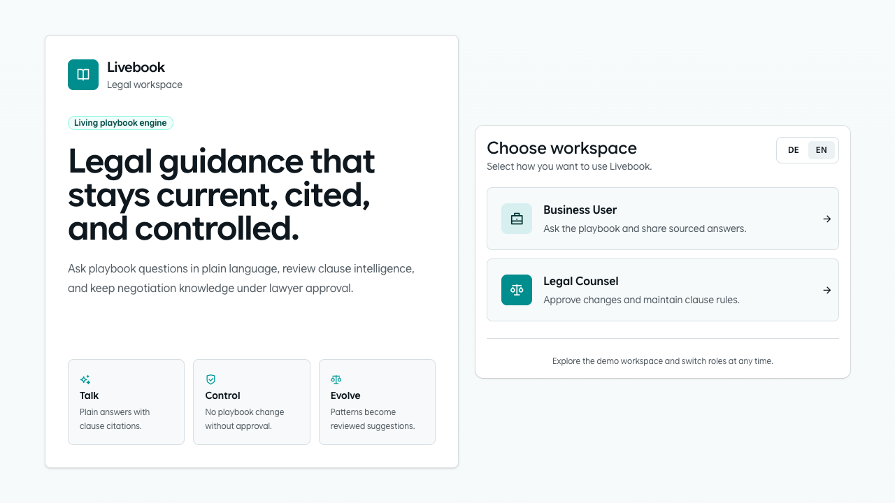
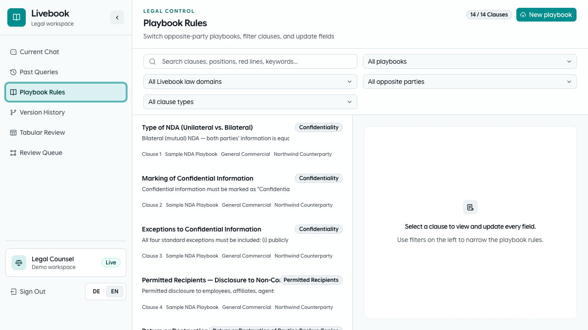
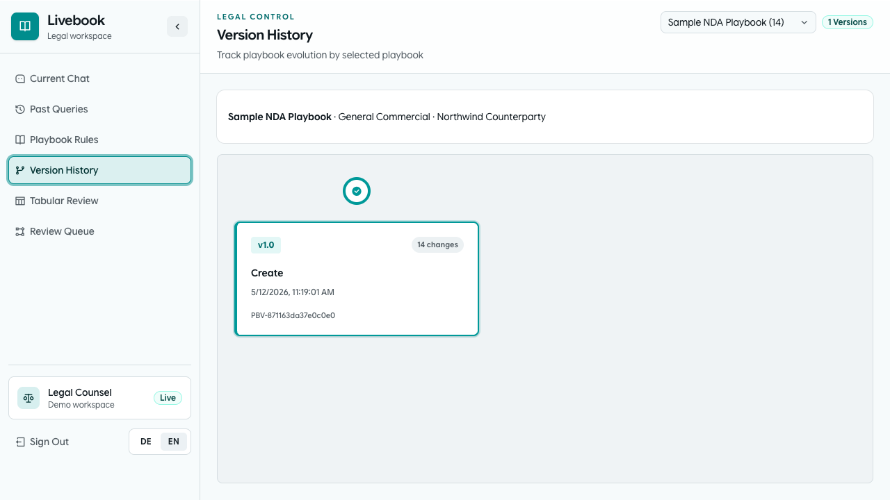

  

# Livebook

Livebook is an AI-assisted legal workspace for managing contract playbooks,
reviewing negotiated language, and keeping approved guidance current across a
team.

It combines a Rust backend, a Next.js web app, and a Microsoft Word add-in so
legal and business users can work from the same source of truth.

## Demo

  

Click the demo for the MP4 version.

## Screenshots

## What it does

- Chat against approved playbook guidance with clause-aware answers
- Manage structured contract rules, escalation triggers, and red lines
- Review tabular contract deviations against the current playbook
- Track playbook history and lawyer-approved evolution over time
- Extend the workflow into Microsoft Word through the task pane add-in

## Stack

- `backend`: Rust, Axum, Postgres, `pgvector`
- `frontend/livebook-ui`: Next.js, React, TypeScript
- `frontend/addin`: Word task pane add-in

## Quick start

See [QUICKSTART.md](QUICKSTART.md) for a short, copy-paste friendly setup guide.

## System

See [SYSTEM.md](SYSTEM.md) for the full architecture and data-flow overview.

## Environment

Required variables:

- `DATABASE_URL`
- `OPENAI_API_KEY`

Common optional variables:

- `OPENAI_MODEL`
- `OPENAI_EMBEDDING_MODEL`
- `OPENAI_EMBEDDING_DIMENSIONS`
- `LIVEBOOK_BACKEND_HOST`
- `LIVEBOOK_BACKEND_PORT`
- `ESCALATION_NOTIFICATION_MODE`
- `LIVEBOOK_BACKEND_URL`
- `NEXT_PUBLIC_AGENTATION_ENDPOINT`
- `VITE_LIVEBOOK_API_URL`

For `docker compose`, the internal service URLs are set by Compose itself. In
practice, you usually only need to provide secrets and model overrides in
`.env`, especially `OPENAI_API_KEY`.

## Repository layout

- [backend](backend): API, storage, review, retrieval, and workflow orchestration
- [frontend/livebook-ui](frontend/livebook-ui): primary browser application
- [frontend/addin](frontend/addin): Word add-in
- [docker-compose.yml](docker-compose.yml): local Docker stack for Postgres, backend, and web UI

## Open source

This repository is licensed under `AGPL-3.0-only`. If you modify Livebook and
run it as a network service, you must make the corresponding source code
available under the same license terms.

See [LICENSE](LICENSE), [CONTRIBUTING.md](CONTRIBUTING.md), and
[SECURITY.md](SECURITY.md).
