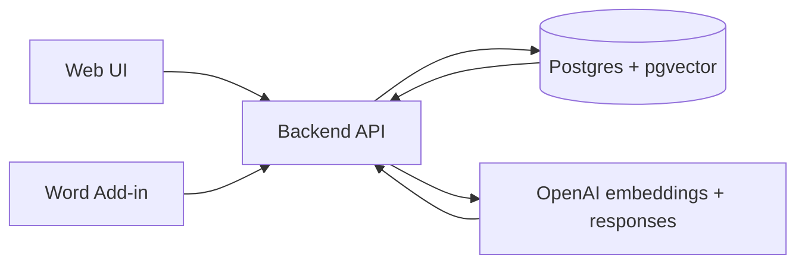

# Livebook System Overview

This document explains how the Livebook system fits together and how requests
move through the stack.

## Components

- `backend`: Rust API built with Axum
- `frontend/livebook-ui`: Next.js web app for the main workspace
- `frontend/addin`: Microsoft Word task pane add-in
- Postgres: persistent storage and runtime state
- `pgvector`: vector search for retrieval-augmented answering
- OpenAI: embeddings and answer generation

## High-Level Flow

## Startup

The normal local path is:

1. Start Postgres with `docker compose up -d postgres`.
2. Start the full app with `make dev`.
3. Open the web UI or Word add-in through the local HTTPS gateway.

The root README documents the default URLs and the project-specific ports.

## Data Model

The backend bootstraps these main tables:

- `documents`: shared JSON documents such as the current playbook snapshot
- `playbooks`: top-level playbook records
- `clauses`: approved clauses and their structured payload
- `clause_versions`: historical clause snapshots
- `clause_embeddings`: pgvector-backed embeddings for clause retrieval
- `chat_queries`: question/answer history
- `escalations`: lawyer review queue
- `tabular_review_sessions` and `tabular_review_rows`: contract review results
- `evolve_suggestions`: review-driven improvement suggestions
- `audit_records`: append-only audit trail

## Retrieval Flow

When a user asks a question:

1. The UI or add-in sends the question to `POST /question`.
2. The backend applies prompt-injection guardrails and special-case handlers.
3. The backend loads the approved playbook context.
4. If `OPENAI_API_KEY` is missing, the request fails with an error.
5. The question plus recent history is embedded and `pgvector` similarity
   search returns the most relevant approved clauses.
6. If no vector hits exist, the backend returns an empty retrieval set instead
   of switching to keyword ranking.
7. The retrieved clauses are serialized as evidence and sent to OpenAI's
   responses API.
8. The model returns structured JSON with the answer, clause reference,
   position used, escalation flag, and next action.
9. The backend validates the response and stores the chat query.

## Embeddings

Embeddings are refreshed when a playbook changes. The backend extracts a text
representation for each approved clause, sends it to the OpenAI embeddings API,
and upserts the result into `clause_embeddings`.

The database schema uses `VECTOR(n)` where `n` comes from
`OPENAI_EMBEDDING_DIMENSIONS`. The default model and dimension values are set in
`.env.example`.

If `OPENAI_API_KEY` is missing, embedding refresh reports an error. Transient
OpenAI request failures can still mark an embedding row stale, but the retrieval
path itself no longer switches to keyword fallback.

## Tabular Review

Tabular review uses OpenAI to extract structured clause outcomes from uploaded
contracts.

- If `OPENAI_API_KEY` is missing, the tabular review request fails with an error.
- There is no local deterministic fallback path for contract analysis.
- The OpenAI response is mapped directly into tabular review rows.

## Escalation Flow

Escalation is used when a result needs lawyer review.

1. The frontend creates an escalation record through `POST /escalations`.
2. The backend writes the item to the escalation queue.
3. The backend links the escalation back to the originating chat query.
4. The queue is displayed in the lawyer review UI.
5. A lawyer can resolve or decline the item, which updates the linked chat
   query review state.

Notification delivery is controlled by `ESCALATION_NOTIFICATION_MODE`.

## Word Add-in

The Word add-in reads either the selection or the full document, converts the
content into review text, and sends it to the backend review endpoints.

It also supports:

- asking Livebook questions from Word
- creating escalation items from Word answers
- applying review insights back into the document workflow

## Web UI Extras

The web app can load the Agentation widget in development mode only. That is a
client-side helper and is disabled unless an endpoint is supplied.

## Environment Variables

### `ESCALATION_NOTIFICATION_MODE`

Controls whether escalation notifications are reported as `mocked` or `sent`.
In the code, `sent` is treated as the live notification mode. Any other value
falls back to mocked notifications.

### `NEXT_PUBLIC_AGENTATION_ENDPOINT`

Optional browser-side endpoint for the Agentation widget in the web UI.
It is only used in development. If unset, the widget does not render.

### `VITE_LIVEBOOK_API_URL`

Build-time base URL for the Word add-in. If set, the built add-in calls that
absolute API URL. If empty, the add-in uses the local `/api` proxy path, which
is what you usually want in local development.

## Related Files

- [backend/src/routes/question.rs](backend/src/routes/question.rs)
- [backend/src/services/retrieval.rs](backend/src/services/retrieval.rs)
- [backend/src/routes/escalation.rs](backend/src/routes/escalation.rs)
- [backend/src/db.rs](backend/src/db.rs)
- [frontend/livebook-ui/src/components/AgentationWrapper.tsx](frontend/livebook-ui/src/components/AgentationWrapper.tsx)
- [frontend/addin/src/api.ts](frontend/addin/src/api.ts)
- [frontend/addin/scripts/build.mjs](frontend/addin/scripts/build.mjs)
